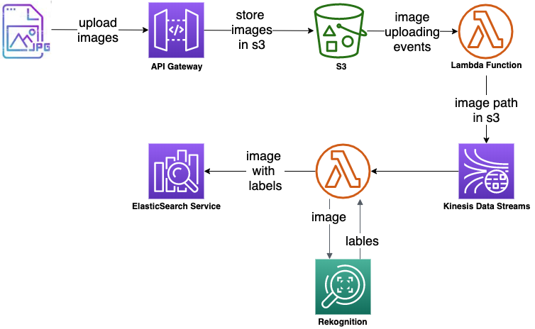
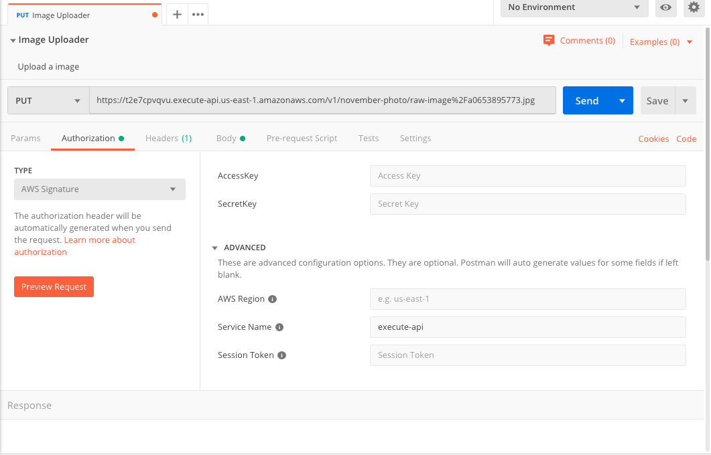
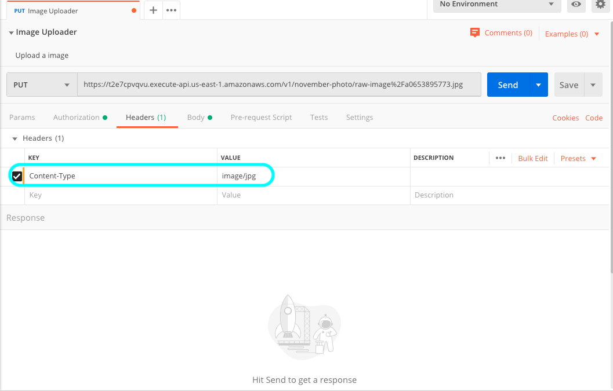
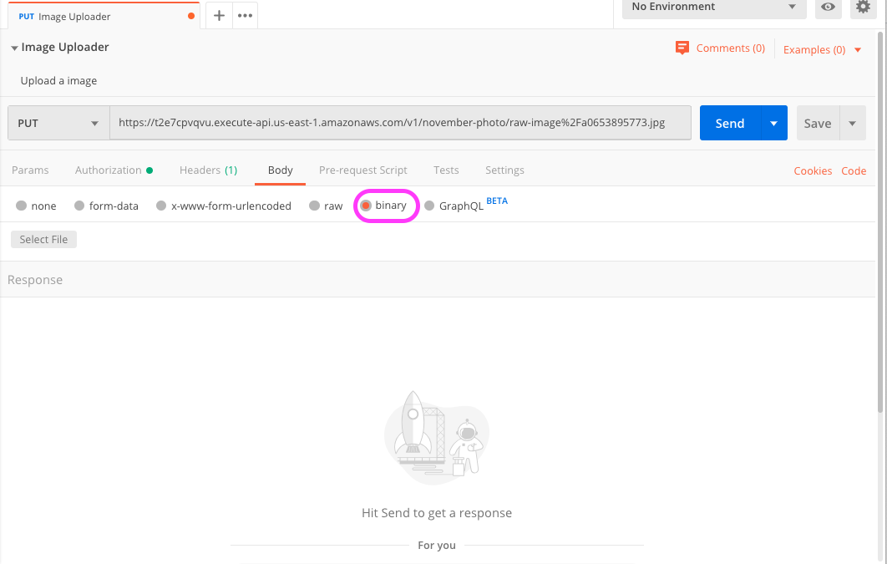
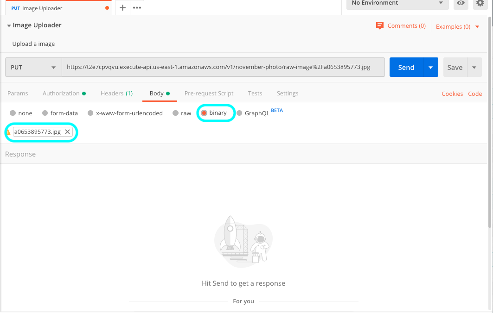

# Project

- Amazon Rekognition을 활용한 이미지 자동 태킹 및 이미지 태그 데이터 시각화 서비스

### Architecture


##### Key AWS Services
- API Gateway
- Lambda Function
- Kinesis Data Stream
- Elasticsearch Service
- Rekognition
- S3

### How To Build & Deploy
1. [Getting Started With the AWS CDK](https://docs.aws.amazon.com/cdk/latest/guide/getting_started.html)를 참고해서 cdk를 설치하고,
cdk를 실행할 때 사용할 IAM User를 생성한 후, `~/.aws/config`에 등록함
예를 들어서, cdk_user라는 IAM User를 생성 한 후, 아래와 같이 `~/.aws/config`에 추가로 등록함

    ```shell script
    $ cat ~/.aws/config
    [profile cdk_user]
    aws_access_key_id=AKIAI44QH8DHBEXAMPLE
    aws_secret_access_key=je7MtGbClwBF/2Zp9Utk/h3yCo8nvbEXAMPLEKEY
    region=us-east-1
    ```

2. Lambda Layer에 등록할 Python 패키지를 생성해서 s3 bucket에 저장함
에를 들어, elasticsearch 패키지를 Lambda Layer에 등록 할 수 있도록 november-photo-resources라는 이름의 s3 bucket을 생성 후, 아래와 같이 저장함

    ```shell script
    $ aws s3 ls s3://november-photo-resources/var/
    2019-10-25 08:38:50          0
    2019-10-25 08:40:28    1294387 es-lib.zip
    ```

3. 소스 코드를 git에서 다운로드 받은 후, `S3_BUCKET_LAMBDA_LAYER_LIB` 라는 환경 변수에 lambda layer에 등록할 패키지가 저장된 s3 bucket 이름을
설정 한 후, `cdk deploy` 명령어를 이용해서 배포함

    ```shell script
    $ git clone https://github.com/ksmin23/november-photo.git
    $ cd november-photo
    $ python3 -m venv .env
    $ source .env/bin/activate
    (.env) $ pip install -r requirements.txt
    (.env) $ S3_BUCKET_LAMBDA_LAYER_LIB=november-photo-resources cdk --profile cdk_user deploy
    ```

4. 배포한 애플리케이션을 삭제하려면, `cdk destroy` 명령어를 아래와 같이 실행
    ```shell script
    (.env) $ cdk --profile cdk_user destroy
    ```

### Kibana dashboards 가져오기
1. Kibana toolbar에서 Management > Saved Objets 탭 선택함
2. Import button 클릭 후에 가져올 dashboards json 파일(```resources/es-kibana/kibana-export.json```)을 선택함
3. Dashboards 탭을 열어서 가져온 dashboard른 선택해서 dashboard를 사용하면 됨

### Demo
##### 이미지를 등록하는 방법

- **Postman을 이용해서 이미지 업로드 API로 명함을 등록하는 방법**

  1. Postman에서 아래 그림과 같이 Authorization 탭에서 TYPE을 AWS Signature로 선택하고, S3 Read/Write 권한을 가진 사용자의 
 AccessKey, SecretKey를 등록하고, AWS Region을 설정함<br/>
  
  2. Headers 탭을 선택하고, Key, Value를 아래 그림과 같이 추가함<br/>
  
  3. Body 탭에서 binary를 선택하고, Select File 버튼을 눌러서, 전송할 파일을 추가함<br/>
  
  4. 전송할 이미지 파일이 추가한 후, Send 버튼을 눌러서 PUT 메소드를 실행함<br/>
  

- **demo용 클라이언트를 사용하는 방법**

  1. 업로드한 명함 이미지를 저장할 s3 bucket의 CORS 설정을 아래 처럼 변경함
        ```
        <?xml version="1.0" encoding="UTF-8"?>
        <CORSConfiguration xmlns="http://s3.amazonaws.com/doc/2006-03-01/">
        <CORSRule>
            <AllowedOrigin>*</AllowedOrigin>
            <AllowedMethod>GET</AllowedMethod>
            <MaxAgeSeconds>3000</MaxAgeSeconds>
            <AllowedHeader>Authorization</AllowedHeader>
        </CORSRule>
        <CORSRule>
            <AllowedOrigin>*</AllowedOrigin>
            <AllowedMethod>POST</AllowedMethod>
            <MaxAgeSeconds>3000</MaxAgeSeconds>
            <AllowedHeader>Authorization</AllowedHeader>
        </CORSRule>
        </CORSConfiguration>
        ```
        - ex)
           
   2. https://github.com/ksmin23/s3-direct-uploader-demo 를 로컬 PC에 git clone 한 후, 설정을 변경해줘야 할 부분을 알맞게 수정함
   3. 수정한 이후, index.html 파일을 browser로 열어서 사용함

